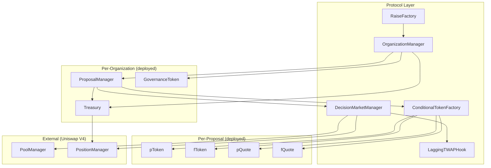
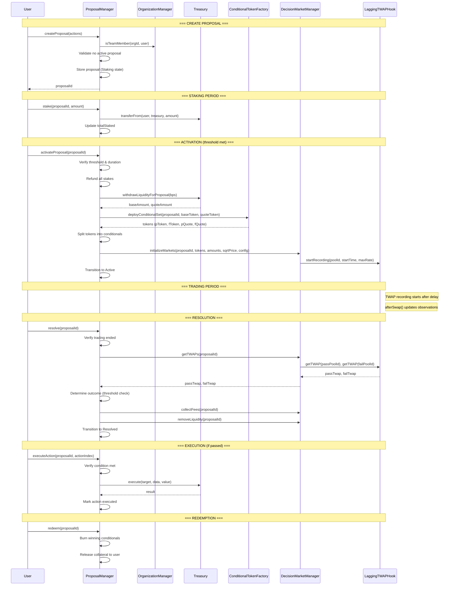
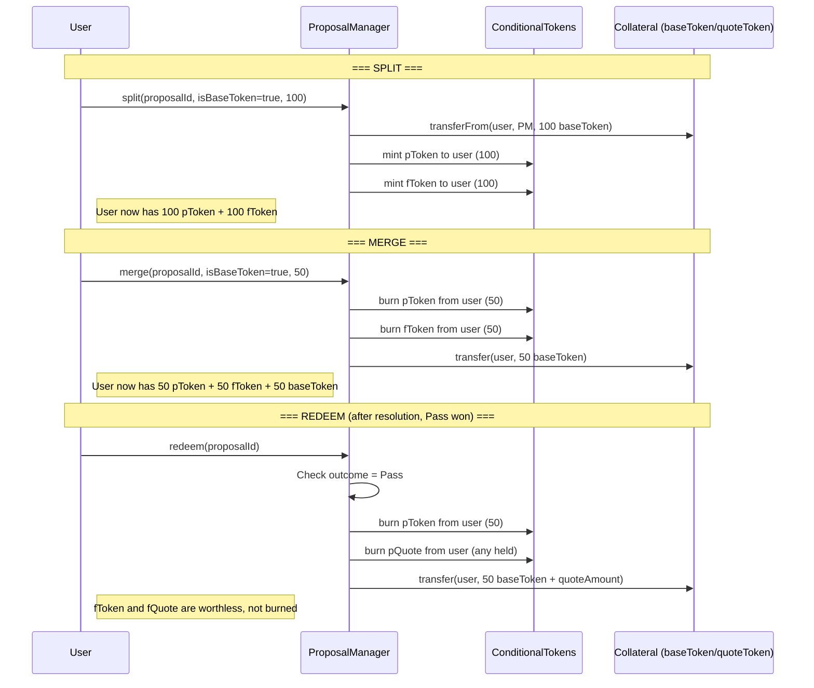
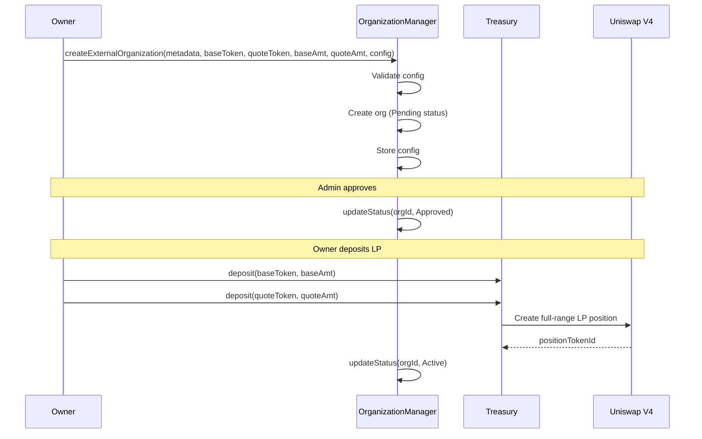
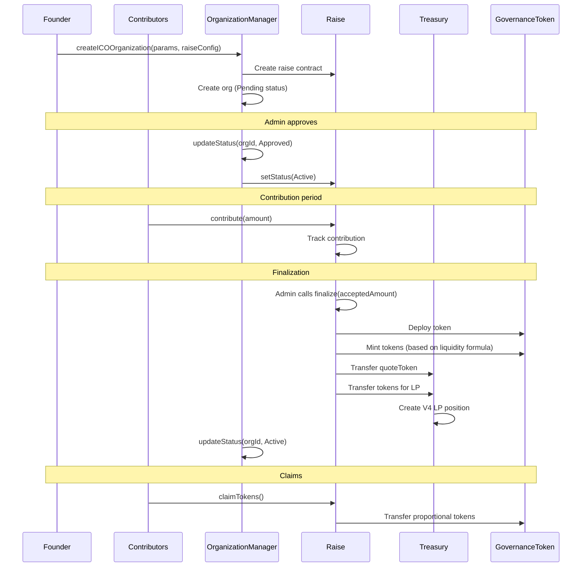

# ArchDAO Smart Contract Specification

> **Version**: 1.0.0-draft  
> **Last Updated**: January 2026  
> **Authors**: ArchDAO Team

---

## Table of Contents

1. [Overview](#1-overview)
2. [Architecture](#2-architecture)
3. [Core Concepts](#3-core-concepts)
4. [Contract Specifications](#4-contract-specifications)
5. [Data Structures](#5-data-structures)
6. [Lifecycle Flows](#6-lifecycle-flows)
7. [Access Control](#7-access-control)
8. [Configuration Parameters](#8-configuration-parameters)
9. [Uniswap V4 Integration](#9-uniswap-v4-integration)
10. [Security Considerations](#10-security-considerations)

---

## 1. Overview

### 1.1 Purpose

ArchDAO implements **futarchy governance** for DAOs — a system where proposals pass or fail based on prediction market prices rather than token-weighted voting. The protocol enables organizations to leverage market-based decision making by creating conditional token markets for each governance proposal.

### 1.2 Core Principle

> **"Vote on Values, Bet on Beliefs"** — Robin Hanson

The governance token price serves as the objective function. Proposals are accepted if the market predicts they will increase token value.

### 1.3 Resolution Condition

A proposal passes if:

```
TWAP(pToken/pQuote) > TWAP(fToken/fQuote) × (1 + threshold)
```

Where:

- `TWAP(pToken/pQuote)` = Time-weighted average price of pass conditional market
- `TWAP(fToken/fQuote)` = Time-weighted average price of fail conditional market
- `threshold` = Pass threshold (positive for non-team, negative for team proposals)

---

## 2. Architecture

### 2.1 System Diagram



### 2.2 Contract Overview

| Contract                  | Type          | Purpose                                                    |
| ------------------------- | ------------- | ---------------------------------------------------------- |
| `OrganizationManager`     | Singleton     | Central registry for all orgs, configs, roles              |
| `Treasury`                | Per-Org       | Holds assets, manages LP position, executes proposals      |
| `ProposalManager`         | Per-Org       | Proposal lifecycle, staking, split/merge/redeem            |
| `GovernanceToken`         | Per-Org (ICO) | ERC-20 governance token with mint authority                |
| `ConditionalTokenFactory` | Singleton     | Deploys conditional token sets per proposal                |
| `ConditionalToken`        | Per-Proposal  | ERC-20 conditional tokens (pToken, fToken, pQuote, fQuote) |
| `DecisionMarketManager`   | Singleton     | Manages V4 pool initialization and LP                      |
| `LaggingTWAPHook`         | Singleton     | V4 hook for rate-limited TWAP observations                 |
| `RaiseFactory`            | Singleton     | Deploys ICO raise contracts                                |
| `Raise`                   | Per-Org (ICO) | Handles contributions, finalization, token distribution    |

---

## 3. Core Concepts

### 3.1 Organization Types

#### ICO Organizations

New projects launching through ArchDAO's fundraising mechanism.

**Flow**: `Pending → Approved → Raise → Active`

- New governance token minted and distributed to contributors
- Treasury funded from raise proceeds
- Config agreed upon during raise, locked at finalization

#### External Organizations

Existing projects with tokens adopting futarchy governance.

**Flow**: `Pending → Approved → Active`

- Uses existing ERC-20 governance token
- Project commits baseToken + quoteToken to treasury
- Treasury creates new V4 LP position

### 3.2 Conditional Token System

For each proposal, four conditional tokens are created:

| Token    | Collateral | Redeemable When |
| -------- | ---------- | --------------- |
| `pToken` | baseToken  | Proposal passes |
| `fToken` | baseToken  | Proposal fails  |
| `pQuote` | quoteToken | Proposal passes |
| `fQuote` | quoteToken | Proposal fails  |

**Fundamental Identity**:

```
1 baseToken ⟺ 1 pToken + 1 fToken
1 quoteToken ⟺ 1 pQuote + 1 fQuote
```

**Operations**:

- **Split**: Lock collateral → mint equal pass + fail tokens
- **Merge**: Burn equal pass + fail tokens → release collateral
- **Redeem**: After resolution, burn winning tokens → release collateral

### 3.3 Lagging TWAP

To prevent price manipulation, the protocol uses a **rate-limited observation** system:

```solidity
// Observation can only move by maxDelta per update
maxDelta = lastObservedPrice × observationMaxRateBpsPerSecond × elapsedSeconds / 10000

if (currentPrice > lastObservedPrice) {
    newObservation = min(currentPrice, lastObservedPrice + maxDelta)
} else {
    newObservation = max(currentPrice, lastObservedPrice - maxDelta)
}
```

**Key Parameters**:

- `observationMaxRateBpsPerSecond`: Rate limit (default ~8 bps/sec for 72%/day)
- `twapRecordingDelay`: Time before recording starts (default 24 hours)

### 3.4 Serial Execution

Only **one proposal** can exist in any non-terminal state at a time. This concentrates liquidity and market attention on a single decision, maximizing manipulation resistance.

```
[Empty] → [Staking] → [Active] → [Resolved] → [Executed] → [Empty]
              ↓                        ↓
         [Cancelled]               [Failed]
```

---

## 4. Contract Specifications

### 4.1 OrganizationManager

Central singleton managing all organization state.

#### State Variables

```solidity
// Counters
uint256 public orgCount;

// Protocol config
address public protocolFeeRecipient;
uint256 public treasuryFeeShareBps;  // Initially 0

// Protocol access
mapping(address => bool) public protocolAdmins;

// Organization data
mapping(uint256 orgId => OrganizationState) public organizations;
mapping(uint256 orgId => OrganizationConfig) public configs;
mapping(uint256 orgId => address) public treasuries;
mapping(uint256 orgId => address) public proposalManagers;
mapping(uint256 orgId => address) public governanceTokens;
mapping(uint256 orgId => address) public raises;

// Roles
mapping(uint256 orgId => mapping(address => OrgRole)) public roles;

// Pause state
bool public paused;
```

#### Functions

```solidity
// ============ Organization Creation ============

function createICOOrganization(
    string calldata metadataURI,
    address quoteToken,
    string calldata tokenName,
    string calldata tokenSymbol,
    OrganizationConfig calldata config,
    RaiseConfig calldata raiseConfig
) external returns (uint256 orgId);

function createExternalOrganization(
    string calldata metadataURI,
    address baseToken,
    address quoteToken,
    uint256 baseTokenAmount,
    uint256 quoteTokenAmount,
    OrganizationConfig calldata config
) external returns (uint256 orgId);

// ============ Organization Management ============

function updateConfig(uint256 orgId, OrganizationConfig calldata newConfig) external;
// Access: Only via passed proposal (onlyGovernance modifier)

function updateMetadata(uint256 orgId, string calldata uri) external;
// Access: Only via passed proposal (onlyGovernance modifier)

function updateStatus(uint256 orgId, OrganizationStatus status) external;
// Access: Protocol admin only

// ============ Role Management ============

function addTeamMember(uint256 orgId, address member) external;
// Access: Org owner only

function removeTeamMember(uint256 orgId, address member) external;
// Access: Org owner only

function transferOwnership(uint256 orgId, address newOwner) external;
// Access: Org owner only

// ============ Protocol Admin ============

function grantProtocolAdmin(address account) external;
function revokeProtocolAdmin(address account) external;
function setFeeRecipient(address recipient) external;
function setTreasuryFeeShare(uint256 newShareBps) external;
function pause() external;
function unpause() external;
// Access: Protocol admin only

// ============ View Functions ============

function getOrganization(uint256 orgId) external view
    returns (OrganizationState memory state, OrganizationConfig memory config);

function getEffectiveStakeThreshold(uint256 orgId, address user) external view
    returns (uint256);

function isTeamMember(uint256 orgId, address user) external view
    returns (bool);

function isOwner(uint256 orgId, address user) external view
    returns (bool);
```

#### Events

```solidity
event OrganizationCreated(uint256 indexed orgId, OrganizationType orgType, address indexed owner);
event OrganizationStatusUpdated(uint256 indexed orgId, OrganizationStatus status);
event ConfigUpdated(uint256 indexed orgId);
event MetadataUpdated(uint256 indexed orgId, string uri);
event TeamMemberAdded(uint256 indexed orgId, address indexed member);
event TeamMemberRemoved(uint256 indexed orgId, address indexed member);
event OwnershipTransferred(uint256 indexed orgId, address indexed previousOwner, address indexed newOwner);
event ProtocolAdminGranted(address indexed account);
event ProtocolAdminRevoked(address indexed account);
event FeeRecipientUpdated(address indexed recipient);
event TreasuryFeeShareUpdated(uint256 newShareBps);
event Paused(address indexed account);
event Unpaused(address indexed account);
```

---

### 4.2 Treasury

Manages organization assets and LP positions.

#### State Variables

```solidity
uint256 public orgId;
OrganizationManager public manager;

IERC20 public baseToken;
IERC20 public quoteToken;

IPositionManager public positionManager;
uint256 public spotPositionTokenId;

bool public initialized;
```

#### Functions

```solidity
function initialize(
    uint256 _orgId,
    OrganizationManager _manager,
    address _baseToken,
    address _quoteToken,
    IPositionManager _positionManager
) external;

// ============ Deposits ============

function deposit(address token, uint256 amount) external;

// ============ LP Management ============

function createSpotPosition(
    uint256 baseAmount,
    uint256 quoteAmount,
    PoolKey calldata poolKey
) external;
// Access: OrganizationManager only (during setup)

function withdrawLiquidityForProposal(uint256 allocationBps) external
    returns (uint256 baseAmount, uint256 quoteAmount);
// Access: ProposalManager only

function addLiquidityAfterResolution(uint256 baseAmount, uint256 quoteAmount) external;
// Access: ProposalManager only

// ============ Proposal Execution ============

function execute(
    address target,
    bytes calldata data,
    uint256 value
) external returns (bytes memory);
// Access: ProposalManager only (for passed proposals)

// ============ Fee Collection ============

function collectFeesFromSpotPool() external returns (uint256 baseAmount, uint256 quoteAmount);
// Distributes fees according to treasuryFeeShareBps

// ============ View Functions ============

function getSpotPositionLiquidity() external view returns (uint128);
function getSpotPositionAmounts() external view returns (uint256 baseAmount, uint256 quoteAmount);
function getBalance(address token) external view returns (uint256);
```

#### Events

```solidity
event Deposited(address indexed token, address indexed from, uint256 amount);
event SpotPositionCreated(uint256 indexed tokenId, uint256 baseAmount, uint256 quoteAmount);
event LiquidityWithdrawn(uint256 baseAmount, uint256 quoteAmount);
event LiquidityAdded(uint256 baseAmount, uint256 quoteAmount);
event ProposalExecuted(address indexed target, bytes data, uint256 value, bytes result);
event FeesCollected(uint256 baseAmount, uint256 quoteAmount, uint256 protocolShare, uint256 treasuryShare);
```

---

### 4.3 ProposalManager

Manages the complete proposal lifecycle.

#### State Variables

```solidity
uint256 public orgId;
OrganizationManager public manager;
Treasury public treasury;
ConditionalTokenFactory public tokenFactory;
DecisionMarketManager public marketManager;

uint256 public proposalCount;
uint256 public activeProposalId;  // 0 if no active proposal

mapping(uint256 proposalId => Proposal) public proposals;
mapping(uint256 proposalId => mapping(address => uint256)) public stakes;

bool public initialized;
```

#### Functions

```solidity
function initialize(
    uint256 _orgId,
    OrganizationManager _manager,
    Treasury _treasury,
    ConditionalTokenFactory _tokenFactory,
    DecisionMarketManager _marketManager
) external;

// ============ Proposal Lifecycle ============

function createProposal(ProposalAction[] calldata actions) external returns (uint256 proposalId);
// Requirements:
// - No existing non-terminal proposal
// - Caller is owner or team member
// - At least one action
// Creates proposal in Staking state

function stake(uint256 proposalId, uint256 amount) external;
// Requirements:
// - Proposal in Staking state
// - Transfers baseToken from caller

function unstake(uint256 proposalId, uint256 amount) external;
// Requirements:
// - Proposal in Staking state
// - Caller has sufficient stake

function activateProposal(uint256 proposalId) external;
// Requirements:
// - Proposal in Staking state
// - Staking threshold met
// - Staking duration passed
// Actions:
// 1. Refund all stakes
// 2. Withdraw LP from treasury
// 3. Deploy conditional tokens
// 4. Initialize decision markets
// 5. Transition to Active state

function cancelProposal(uint256 proposalId) external;
// Requirements:
// - Proposal in Staking state
// - minCancellationDelay passed
// - Caller is owner, team member, or protocol admin
// Actions:
// 1. Refund all stakes
// 2. Transition to Cancelled state

function resolve(uint256 proposalId) external;
// Requirements:
// - Proposal in Active state
// - Trading window ended
// Actions:
// 1. Fetch final TWAPs
// 2. Determine outcome based on threshold
// 3. Collect fees from decision markets
// 4. Remove LP from decision markets
// 5. Transition to Resolved state

function executeAction(uint256 proposalId, uint256 actionIndex) external;
// Requirements:
// - Proposal in Resolved state
// - Outcome is Pass
// - Action not already executed
// - Execution condition met
// Actions:
// 1. Call treasury.execute() with action data
// 2. Mark action as executed
// 3. If all actions executed, transition to Executed state

// ============ Conditional Token Operations ============

function split(uint256 proposalId, bool isBaseToken, uint256 amount) external;
// Locks collateral, mints equal pToken + fToken (or pQuote + fQuote)

function merge(uint256 proposalId, bool isBaseToken, uint256 amount) external;
// Burns equal pToken + fToken (or pQuote + fQuote), releases collateral

function redeem(uint256 proposalId) external;
// Requirements:
// - Proposal in Resolved or Executed state
// Burns winning tokens, releases collateral

// ============ View Functions ============

function getProposal(uint256 proposalId) external view returns (Proposal memory);
function getStake(uint256 proposalId, address staker) external view returns (uint256);
function canActivate(uint256 proposalId) external view returns (bool);
function canResolve(uint256 proposalId) external view returns (bool);
function canCancel(uint256 proposalId) external view returns (bool);
```

#### Events

```solidity
event ProposalCreated(uint256 indexed proposalId, address indexed proposer, bool isTeamSponsored);
event Staked(uint256 indexed proposalId, address indexed staker, uint256 amount);
event Unstaked(uint256 indexed proposalId, address indexed staker, uint256 amount);
event StakesRefunded(uint256 indexed proposalId, uint256 totalRefunded);
event ProposalActivated(uint256 indexed proposalId, uint256 baseTokenReserve, uint256 quoteTokenReserve);
event ProposalCancelled(uint256 indexed proposalId, address indexed cancelledBy);
event ProposalResolved(uint256 indexed proposalId, ProposalOutcome outcome, uint256 passTwap, uint256 failTwap);
event ActionExecuted(uint256 indexed proposalId, uint256 indexed actionIndex);
event ProposalExecuted(uint256 indexed proposalId);
event ProposalFailed(uint256 indexed proposalId);
event TokensSplit(uint256 indexed proposalId, address indexed user, bool isBaseToken, uint256 amount);
event TokensMerged(uint256 indexed proposalId, address indexed user, bool isBaseToken, uint256 amount);
event TokensRedeemed(uint256 indexed proposalId, address indexed user, uint256 baseAmount, uint256 quoteAmount);
```

---

### 4.4 ConditionalTokenFactory

Deploys conditional token sets for proposals.

#### State Variables

```solidity
mapping(uint256 proposalId => ConditionalTokenSet) public proposalTokens;
mapping(address token => uint256 proposalId) public tokenToProposal;
```

#### Functions

```solidity
function deployConditionalSet(
    uint256 proposalId,
    address baseToken,
    address quoteToken,
    address minter  // ProposalManager address
) external returns (ConditionalTokenSet memory tokens);
// Access: ProposalManager only
// Deploys: pToken, fToken, pQuote, fQuote

function getConditionalTokens(uint256 proposalId) external view
    returns (ConditionalTokenSet memory);

function getProposalForToken(address token) external view
    returns (uint256 proposalId);
```

#### Events

```solidity
event ConditionalSetDeployed(
    uint256 indexed proposalId,
    address pToken,
    address fToken,
    address pQuote,
    address fQuote
);
```

---

### 4.5 ConditionalToken

ERC-20 conditional token with restricted minting.

#### State Variables

```solidity
uint256 public proposalId;
address public collateralToken;
bool public isPassToken;  // true for pToken/pQuote, false for fToken/fQuote
address public minter;    // ProposalManager
```

#### Functions

```solidity
constructor(
    string memory name,
    string memory symbol,
    uint256 _proposalId,
    address _collateralToken,
    bool _isPassToken,
    address _minter
);

function mint(address to, uint256 amount) external;
// Access: Minter only

function burn(address from, uint256 amount) external;
// Access: Minter only
```

---

### 4.6 DecisionMarketManager

Manages Uniswap V4 decision market pools.

#### State Variables

```solidity
IPoolManager public poolManager;
IPositionManager public positionManager;
LaggingTWAPHook public twapHook;

mapping(uint256 proposalId => PoolKey[2]) public proposalPools;  // [passPool, failPool]
mapping(uint256 proposalId => uint256[2]) public proposalPositionIds;  // [passPositionId, failPositionId]
```

#### Functions

```solidity
function initializeMarkets(
    uint256 proposalId,
    ConditionalTokenSet calldata tokens,
    uint256 baseAmount,
    uint256 quoteAmount,
    uint160 sqrtPriceX96,
    uint256 observationMaxRateBpsPerSecond,
    uint256 twapRecordingStartTime
) external returns (PoolKey[2] memory poolKeys);
// Access: ProposalManager only
// Actions:
// 1. Initialize pass pool (pToken/pQuote) at sqrtPriceX96
// 2. Initialize fail pool (fToken/fQuote) at sqrtPriceX96
// 3. Add full-range liquidity to both pools
// 4. Configure TWAP hook for both pools

function removeLiquidity(uint256 proposalId) external
    returns (uint256 pTokenAmount, uint256 pQuoteAmount, uint256 fTokenAmount, uint256 fQuoteAmount);
// Access: ProposalManager only

function collectFees(uint256 proposalId) external
    returns (uint256 pTokenFees, uint256 pQuoteFees, uint256 fTokenFees, uint256 fQuoteFees);
// Access: ProposalManager only

function getPoolKeys(uint256 proposalId) external view returns (PoolKey[2] memory);
function getSpotPrices(uint256 proposalId) external view returns (uint256 passPrice, uint256 failPrice);
function getTWAPs(uint256 proposalId) external view returns (uint256 passTwap, uint256 failTwap);
```

#### Events

```solidity
event MarketsInitialized(uint256 indexed proposalId, PoolKey passPool, PoolKey failPool);
event LiquidityRemoved(uint256 indexed proposalId, uint256 pTokenAmount, uint256 pQuoteAmount, uint256 fTokenAmount, uint256 fQuoteAmount);
event FeesCollected(uint256 indexed proposalId, uint256 totalFees);
```

---

### 4.7 LaggingTWAPHook

Uniswap V4 hook for rate-limited TWAP observations.

#### State Variables

```solidity
mapping(PoolId => TWAPObservation) public observations;
mapping(PoolId => uint256) public recordingStartTime;
mapping(PoolId => uint256) public observationMaxRateBpsPerSecond;
mapping(PoolId => bool) public isRecording;
```

#### Functions

```solidity
// ============ V4 Hook Callbacks ============

function afterSwap(
    address sender,
    PoolKey calldata key,
    IPoolManager.SwapParams calldata params,
    BalanceDelta delta,
    bytes calldata hookData
) external override returns (bytes4, int128);
// Called after every swap, updates observation

// ============ Configuration ============

function startRecording(
    PoolId poolId,
    uint256 startTime,
    uint256 maxRateBpsPerSecond
) external;
// Access: DecisionMarketManager only

function stopRecording(PoolId poolId) external;
// Access: DecisionMarketManager only

// ============ View Functions ============

function getObservedPrice(PoolId poolId) external view returns (uint256);
function getTWAP(PoolId poolId) external view returns (uint256);
function getObservation(PoolId poolId) external view returns (TWAPObservation memory);

// ============ Internal ============

function _updateObservation(PoolId poolId, uint256 currentPrice) internal;
function _calculateMaxDelta(uint256 lastObs, uint256 elapsed, uint256 maxRate) internal pure returns (uint256);
```

#### Hook Flags

```solidity
function getHookPermissions() public pure override returns (Hooks.Permissions memory) {
    return Hooks.Permissions({
        beforeInitialize: false,
        afterInitialize: false,
        beforeAddLiquidity: false,
        afterAddLiquidity: false,
        beforeRemoveLiquidity: false,
        afterRemoveLiquidity: false,
        beforeSwap: false,
        afterSwap: true,  // ← We use this
        beforeDonate: false,
        afterDonate: false,
        beforeSwapReturnDelta: false,
        afterSwapReturnDelta: false,
        afterAddLiquidityReturnDelta: false,
        afterRemoveLiquidityReturnDelta: false
    });
}
```

---

### 4.8 GovernanceToken

Standard ERC-20 with controlled minting for ICO organizations.

#### State Variables

```solidity
address public minter;
```

#### Functions

```solidity
constructor(string memory name, string memory symbol, address _minter);

function mint(address to, uint256 amount) external;
// Access: Minter only

function burn(uint256 amount) external;
// Caller burns their own tokens

function setMinter(address newMinter) external;
// Access: Current minter only
```

---

### 4.9 RaiseFactory

Deploys ICO raise contracts.

#### State Variables

```solidity
OrganizationManager public manager;
mapping(uint256 orgId => address) public raises;
```

#### Functions

```solidity
function createRaise(
    uint256 orgId,
    RaiseConfig calldata config
) external returns (address raiseAddress);
// Access: OrganizationManager only

function getRaise(uint256 orgId) external view returns (address);
```

---

### 4.10 Raise

Handles ICO contributions and token distribution.

#### State Variables

```solidity
uint256 public organizationId;
OrganizationManager public manager;

RaiseStatus public status;
uint256 public softCap;
uint256 public hardCap;
uint256 public acceptedAmount;
uint256 public totalContributed;
uint256 public startDate;
uint256 public endDate;

IERC20 public quoteToken;
OrganizationConfig public agreedConfig;

mapping(address => uint256) public contributions;
address[] public contributors;
```

#### Functions

```solidity
function initialize(
    uint256 _orgId,
    OrganizationManager _manager,
    RaiseConfig calldata config
) external;

function contribute(uint256 amount) external;
// Requirements:
// - Status is Active
// - Within date range
// - Doesn't exceed hardCap

function finalize(uint256 _acceptedAmount) external;
// Access: Protocol admin only
// Requirements:
// - Status is Active
// - End date passed
// - acceptedAmount >= softCap
// Actions:
// 1. Set acceptedAmount (discretionary cap)
// 2. Mint governance tokens
// 3. Create treasury LP position
// 4. Transition org to Active status

function claimTokens() external;
// Requirements:
// - Status is Completed
// - Caller has contribution
// Returns proportional share of tokens

function refund() external;
// Requirements:
// - Status is Failed OR contribution exceeds accepted amount
// Returns excess/full contribution

function fail() external;
// Access: Protocol admin only
// Transitions to Failed status if soft cap not met
```

#### Events

```solidity
event Contributed(address indexed contributor, uint256 amount);
event RaiseFinalized(uint256 acceptedAmount, uint256 tokensDistributed);
event TokensClaimed(address indexed contributor, uint256 amount);
event Refunded(address indexed contributor, uint256 amount);
event RaiseFailed();
```

---

## 5. Data Structures

### 5.1 Enums

```solidity
enum OrganizationType {
    ICO,        // New project with raise
    External    // Existing token
}

enum OrganizationStatus {
    Pending,    // Awaiting admin approval
    Approved,   // Approved, awaiting raise (ICO) or activation (External)
    Raise,      // ICO in progress
    Active,     // Fully operational
    Rejected,   // Admin rejected
    Failed      // Raise failed to meet soft cap
}

enum ProposalStatus {
    Staking,    // Gathering stake support
    Active,     // Trading period
    Resolved,   // Outcome determined, awaiting execution
    Executed,   // All actions executed (pass) or finalized (fail)
    Cancelled,  // Cancelled during staking
    Failed      // Resolved but did not pass
}

enum ProposalOutcome {
    None,       // Not yet resolved
    Pass,       // Passed, actions can execute
    Fail        // Failed, no actions execute
}

enum ActionType {
    TreasurySpend,      // Transfer tokens from treasury
    MintTokens,         // Mint governance tokens
    BurnTokens,         // Burn governance tokens from treasury
    AdjustLP,           // Modify treasury LP position
    UpdateMetadata,     // Update org metadata URI
    UpdateConfig,       // Update org config
    Custom              // Arbitrary contract call
}

enum ExecutionCondition {
    Immediate,              // Execute right after resolution
    TimeLocked,             // Execute after delay
    MarketCapThreshold,     // Execute when mcap >= X
    PriceThreshold,         // Execute when price >= X
    CustomOracle            // Execute when oracle condition met
}

enum RaiseStatus {
    Pending,        // Not yet started
    Active,         // Accepting contributions
    Finalizing,     // End date passed, awaiting admin finalization
    Completed,      // Successfully finalized
    Failed          // Did not meet soft cap
}
```

### 5.2 Structs

```solidity
struct OrganizationState {
    OrganizationType orgType;
    OrganizationStatus status;
    string metadataURI;
    address baseToken;
    address quoteToken;
    address owner;
    uint256 createdAt;
}

struct OrganizationConfig {
    // Pass threshold settings
    uint256 minTwapSpreadBps;           // Minimum spread for pass (e.g., 300 = 3%)
    int256 teamPassThresholdBps;        // Team proposal threshold (e.g., -300 = -3%)
    int256 nonTeamPassThresholdBps;     // Non-team threshold (e.g., 300 = 3%)

    // Staking settings
    uint256 defaultStakingThreshold;    // Absolute token amount for non-team
    uint256 teamStakingThresholdBps;    // Team threshold as bps of supply (e.g., 300 = 3%)
    uint256 ownerStakingThresholdBps;   // Owner threshold as bps (e.g., 500 = 5%)

    // Timing settings
    uint256 stakingDuration;            // Default 48 hours
    uint256 tradingDuration;            // Default 4 days
    uint256 twapRecordingDelay;         // Default 24 hours
    uint256 minCancellationDelay;       // Default 24 hours

    // TWAP settings
    uint256 observationMaxRateBpsPerSecond;  // Rate limit for observations

    // LP settings
    uint256 lpAllocationPerProposalBps;      // % of treasury LP per proposal
}

struct OrgRole {
    bool isOwner;
    bool isTeamMember;
    uint256 customStakeThreshold;  // 0 = use default for role
}

struct Proposal {
    uint256 id;
    address proposer;
    bool isTeamSponsored;
    ProposalStatus status;
    ProposalOutcome outcome;

    // Staking
    uint256 totalStaked;
    uint256 stakingEndsAt;

    // Trading
    uint256 tradingStartsAt;
    uint256 tradingEndsAt;
    uint256 twapRecordingStartsAt;

    // Reserves (snapshot at activation)
    uint256 baseTokenReserve;
    uint256 quoteTokenReserve;

    // Conditional tokens
    ConditionalTokenSet tokens;

    // Markets
    PoolKey passPoolKey;
    PoolKey failPoolKey;

    // Resolution
    uint256 passTwap;
    uint256 failTwap;
    uint256 resolvedAt;

    // Actions
    ProposalAction[] actions;
}

struct ProposalAction {
    ActionType actionType;
    address target;
    bytes data;
    uint256 value;
    ExecutionCondition condition;
    bytes conditionData;
    bool executed;
}

struct ConditionalTokenSet {
    address pToken;
    address fToken;
    address pQuote;
    address fQuote;
}

struct TWAPObservation {
    uint256 timestamp;
    uint256 observedPrice;
    uint256 cumulativePrice;
}

struct RaiseConfig {
    uint256 softCap;
    uint256 hardCap;
    uint256 startDate;
    uint256 endDate;
    address quoteToken;
    OrganizationConfig agreedConfig;
}
```

---

## 6. Lifecycle Flows

### 6.1 Proposal Lifecycle



### 6.2 Split/Merge/Redeem Flow



### 6.3 External Organization Onboarding



### 6.4 ICO Raise Flow



---

## 7. Access Control

### 7.1 Protocol Level

| Role            | Capabilities                                                                                                       |
| --------------- | ------------------------------------------------------------------------------------------------------------------ |
| `protocolAdmin` | Pause/unpause, set fee recipient, set treasury fee share, approve/reject orgs, finalize raises, grant/revoke admin |

### 7.2 Organization Level

| Role            | Create Proposal | Stake Threshold            | Cancel Proposal  | Add Team | Update Config |
| --------------- | --------------- | -------------------------- | ---------------- | -------- | ------------- |
| **Owner**       | ✅              | `ownerStakingThresholdBps` | ✅ (after delay) | ✅       | Via proposal  |
| **Team Member** | ✅              | `teamStakingThresholdBps`  | ✅ (after delay) | ❌       | Via proposal  |
| **Anyone**      | ❌              | N/A                        | ❌               | ❌       | ❌            |

### 7.3 Modifier Reference

```solidity
modifier onlyProtocolAdmin() {
    require(protocolAdmins[msg.sender], "Not protocol admin");
    _;
}

modifier onlyOwner(uint256 orgId) {
    require(roles[orgId][msg.sender].isOwner, "Not owner");
    _;
}

modifier onlyTeamOrOwner(uint256 orgId) {
    OrgRole memory role = roles[orgId][msg.sender];
    require(role.isOwner || role.isTeamMember, "Not team or owner");
    _;
}

modifier onlyGovernance(uint256 orgId) {
    require(msg.sender == proposalManagers[orgId], "Not governance");
    _;
}

modifier whenNotPaused() {
    require(!paused, "Protocol paused");
    _;
}
```

---

## 8. Configuration Parameters

### 8.1 Default Values

| Parameter                        | Default      | Description                                    |
| -------------------------------- | ------------ | ---------------------------------------------- |
| `minTwapSpreadBps`               | 300 (3%)     | Minimum spread for pass determination          |
| `teamPassThresholdBps`           | -300 (-3%)   | Team proposals easier to pass                  |
| `nonTeamPassThresholdBps`        | 300 (3%)     | Non-team proposals harder to pass              |
| `defaultStakingThreshold`        | Org-specific | Absolute token amount                          |
| `teamStakingThresholdBps`        | 300 (3%)     | Team member stake requirement                  |
| `ownerStakingThresholdBps`       | 500 (5%)     | Owner stake requirement                        |
| `stakingDuration`                | 48 hours     | Time to gather stake                           |
| `tradingDuration`                | 4 days       | Decision market trading period                 |
| `twapRecordingDelay`             | 24 hours     | Delay before TWAP recording                    |
| `minCancellationDelay`           | 24 hours     | Minimum time before cancel allowed             |
| `observationMaxRateBpsPerSecond` | 8 (~72%/day) | TWAP rate limit                                |
| `lpAllocationPerProposalBps`     | 5000 (50%)   | % of treasury LP per proposal                  |
| `treasuryFeeShareBps`            | 0 (0%)       | Treasury's share of fees (protocol takes rest) |

### 8.2 Calculating TWAP Rate

For desired max daily movement:

```
observationMaxRateBpsPerSecond = (dailyMovementBps × 10000) / (86400 × 10000)
                                = dailyMovementBps / 86400
```

| Daily Max | Bps/Second | Bps Value |
| --------- | ---------- | --------- |
| 29%/day   | 0.000336%  | ~3        |
| 50%/day   | 0.000579%  | ~6        |
| 72%/day   | 0.000833%  | ~8        |
| 100%/day  | 0.001157%  | ~12       |

---

## 9. Uniswap V4 Integration

### 9.1 Pool Configuration

All decision market pools use:

- **Full-range liquidity** (tickLower = MIN_TICK, tickUpper = MAX_TICK)
- **LaggingTWAPHook** attached for TWAP tracking
- **Standard fee tier** (configurable, e.g., 0.3%)

### 9.2 Position Management

Treasury and DecisionMarketManager interact with V4 via `PositionManager`:

```solidity
// Add liquidity
bytes memory actions = abi.encodePacked(
    uint8(Actions.MINT_POSITION),
    uint8(Actions.SETTLE_PAIR)
);
positionManager.modifyLiquidities(abi.encode(actions, params), deadline);

// Remove liquidity
bytes memory actions = abi.encodePacked(
    uint8(Actions.DECREASE_LIQUIDITY),
    uint8(Actions.TAKE_PAIR)
);
positionManager.modifyLiquidities(abi.encode(actions, params), deadline);
```

### 9.3 Hook Integration

The `LaggingTWAPHook` implements only `afterSwap`:

```solidity
function afterSwap(...) external override returns (bytes4, int128) {
    PoolId poolId = key.toId();

    if (isRecording[poolId] && block.timestamp >= recordingStartTime[poolId]) {
        uint256 currentPrice = _getCurrentPrice(key);
        _updateObservation(poolId, currentPrice);
    }

    return (this.afterSwap.selector, 0);
}
```

---

## 10. Security Considerations

### 10.1 TWAP Manipulation Resistance

- **Rate limiting**: Observations can only move `observationMaxRateBpsPerSecond` per second
- **Recording delay**: 24-hour delay before TWAP recording starts
- **Serial execution**: All liquidity concentrated on single proposal

### 10.2 Economic Security

- **Pass threshold**: Requires meaningful spread (±3%) to pass/fail
- **Stake refund**: Stakes returned immediately, no penalty — pure signaling
- **Protocol fees**: 100% of LP fees to protocol, reducing extraction incentives

### 10.3 Access Control

- **Protocol admin**: Can pause but cannot modify individual org configs
- **Org owner**: Cannot bypass governance for config changes
- **Governance-only**: Config and metadata updates require passed proposals

### 10.4 Known Limitations

1. **Serial execution**: Only one proposal at a time may slow governance
2. **External LP**: Anyone can LP in decision markets (permissionless V4)
3. **Oracle dependency**: TWAP relies on V4 pool prices, which can be thin

---

## Appendix A: Folder Structure

```
archdao-contracts/
├── src/
│   ├── core/
│   │   ├── OrganizationManager.sol
│   │   ├── Treasury.sol
│   │   └── ProposalManager.sol
│   ├── tokens/
│   │   ├── GovernanceToken.sol
│   │   ├── ConditionalToken.sol
│   │   └── ConditionalTokenFactory.sol
│   ├── markets/
│   │   ├── DecisionMarketManager.sol
│   │   └── LaggingTWAPHook.sol
│   ├── raise/
│   │   ├── RaiseFactory.sol
│   │   └── Raise.sol
│   ├── interfaces/
│   │   ├── IOrganizationManager.sol
│   │   ├── ITreasury.sol
│   │   ├── IProposalManager.sol
│   │   └── ...
│   └── libraries/
│       ├── ProposalLib.sol
│       ├── TWAPMath.sol
│       └── PoolKeyLib.sol
├── test/
│   ├── unit/
│   ├── integration/
│   └── invariant/
├── script/
│   ├── Deploy.s.sol
│   └── helpers/
├── docs/
│   ├── SPECIFICATION.md
│   └── diagrams/
├── foundry.toml
└── README.md
```

---

## Appendix B: Events Index

| Contract            | Event                       | When Emitted                   |
| ------------------- | --------------------------- | ------------------------------ |
| OrganizationManager | `OrganizationCreated`       | New org created                |
| OrganizationManager | `OrganizationStatusUpdated` | Status changes                 |
| OrganizationManager | `ConfigUpdated`             | Config modified via governance |
| OrganizationManager | `TeamMemberAdded`           | Team member added              |
| Treasury            | `Deposited`                 | Tokens deposited               |
| Treasury            | `LiquidityWithdrawn`        | LP withdrawn for proposal      |
| Treasury            | `ProposalExecuted`          | Action executed                |
| ProposalManager     | `ProposalCreated`           | New proposal                   |
| ProposalManager     | `Staked`                    | User stakes                    |
| ProposalManager     | `ProposalActivated`         | Threshold met, markets created |
| ProposalManager     | `ProposalResolved`          | Outcome determined             |
| ProposalManager     | `TokensSplit`               | User splits collateral         |
| ProposalManager     | `TokensRedeemed`            | User redeems winning tokens    |
| Raise               | `Contributed`               | User contributes to ICO        |
| Raise               | `RaiseFinalized`            | ICO completed                  |

---

## Appendix C: Error Codes

```solidity
// OrganizationManager
error OrgNotFound(uint256 orgId);
error OrgNotActive(uint256 orgId);
error NotProtocolAdmin();
error NotOrgOwner();
error NotTeamMember();
error InvalidConfig();
error ProtocolPaused();

// ProposalManager
error ProposalExists();
error ProposalNotFound(uint256 proposalId);
error InvalidProposalStatus(ProposalStatus current, ProposalStatus required);
error StakingThresholdNotMet(uint256 current, uint256 required);
error TradingNotEnded();
error ActionAlreadyExecuted(uint256 actionIndex);
error ExecutionConditionNotMet();
error InsufficientStake();
error NotProposer();

// Treasury
error InsufficientBalance(address token, uint256 required, uint256 available);
error ExecutionFailed(bytes reason);
error NotProposalManager();

// Raise
error RaiseNotActive();
error RaiseEnded();
error ExceedsHardCap();
error BelowSoftCap();
error AlreadyClaimed();
error NothingToRefund();
```

---
